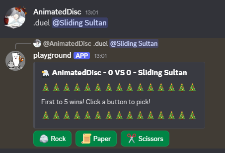
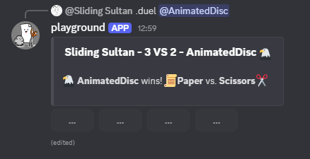
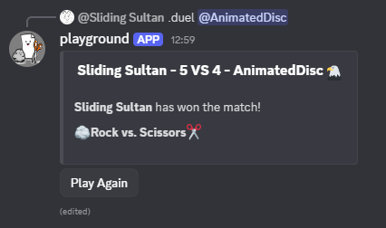
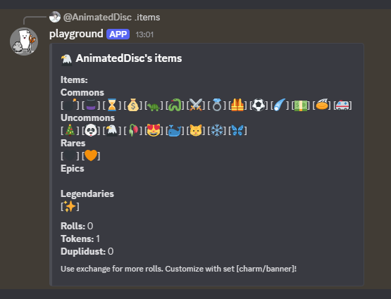
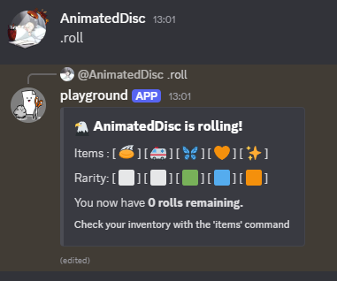

## Introduction
**RPS Dueling Bot** is a **Discord Bot** that allows you to battle your friends in a game of rock-paper-scissors.
It features a streamlined embed interface for quality of life, database usage for storage, and automatic timeouts for memory.

---

## Table of contents
- [Introduction](#-introduction)
- [About](#-about)
- [Screenshots](#-screenshots)
- [Commands](#-commands)
- [Setup](#-setup)

---

## About
The gameplay is a first-to-five game of RPS (rock-paper-scissors), includes a leveling system, and gives rewards through lootboxes.
A simple game that turns into complicated mind-games when playing your friends!
This is a great bot to have on the side of the voice-channel.

---

## Commands
| name        | usage                       |
|-------------|-----------------------------|
| prefix      | /prefix                     |
| restrict    |                             |
| help        | help, help [command]        |
| duel        | duel [@player]              |
| tutorial    |                             |
| score       |                             |
| exchange    |                             |
| roll        |                             |
| items       |                             |
| set         | set [charm/banner] [emoji]  |
| leaderboard |                             |
| hello       |                             |
| dev         | dev [command] [id] [params] |

---

## Screenshots

### Starting a duel:



### Middle of a round:



### Duel finished:



### Items:



### Rolling:



---

## Setup
There are two ways to set up this bot.
You can invite the existing bot onto your discord server, or you can use this repo to create your own bot and edit it to fit your needs.

### Inviting the bot
While you are logged into discord, invite the bot with this link: [Invite Bot](https://discord.com/oauth2/authorize?client_id=1437804596029423709|).
Discord might re-direct you to the app. Follow the invitation process. After this, move on to the [first-time-setup](#-first time setup) section

### Hosting the bot

#### Cloning the repo
To host the bot, first [clone the repo](https://docs.github.com/en/repositories/creating-and-managing-repositories/cloning-a-repository).
You then also need a database, like PostgreSQL, and some terminal to host it on.
I used [Heroku](https://www.heroku.com/) for both.

#### Connection
Set up the connection between your repo and your mirror/host, including the database.

#### Client creation
Because it is a discord bot, you require to make a client for it.
Look through the following guides to understand what and how:
- [Discord JS Website](https://discordjs.guide/legacy)
- [Official Discord Website](https://discord.com/developers/docs/quick-start/overview-of-apps)

#### Tokens
There are two ways to include sensitive information into your code.
If you're using a hosting website like Heroku, you can include them in the config vars or something similar.
If you're hosting it on your own, create a .env file and finish this code in there:

```
# Token
DISCORD_TOKEN="YOUR_TOKEN_HERE"
# Database
DATABASE_URL="YOUR_DATABASE_URL_HERE"
```

**.env files are called secrets, because they must be kept secrets!**

### First Time Setup
When the bot has been set-up, it is best practice to do the following two steps:
1. Setting a prefix with /prefix (default is a period/full-stop)
2. Restricting to a channel using the restrict command

The default prefix is: .
